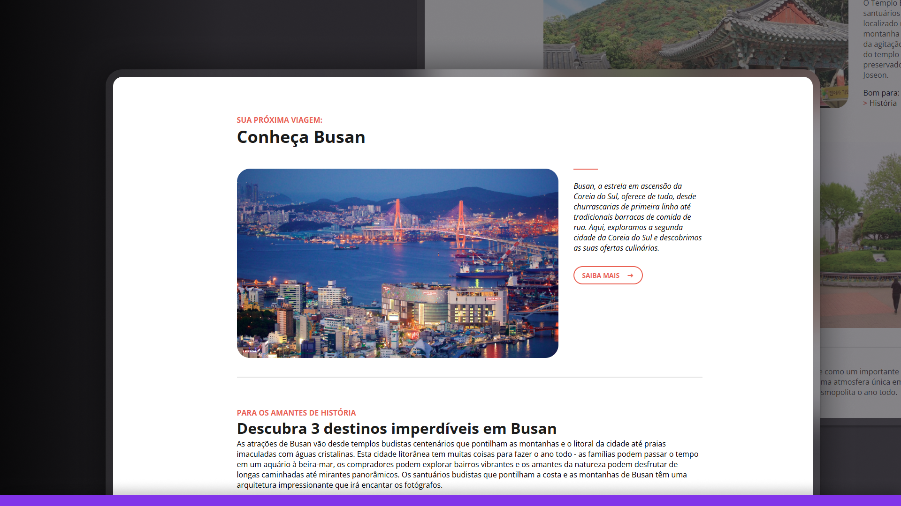

# 🌊 Busan Travel Page

## 📝 About The Project

This project consists of a responsive landing page about tourist attractions in Busan, South Korea. The site features a modern and elegant interface that highlights the main tourist attractions of South Korea's second-largest city, focusing on historic temples and points of interest.

The page was developed as a practical exercise to apply and consolidate fundamental knowledge of front-end web development, prioritizing HTML semantics, responsive layout, and CSS best practices.

## 🚀 Technologies Used

- **HTML5** - Semantic content structuring
- **CSS3** - Complete and responsive styling
- **Google Fonts** - Typography with Open Sans font
- **SVG** - Vector icons for visual elements

## ✨ Applied Concepts

### HTML
- Semantic markup with modern tags (header, article, section, footer)
- Proper content structuring for accessibility
- Use of images with alt attributes for better accessibility
- Internal links for navigation on the same page (#discover)
- External links with target="_blank" to open in a new tab

### CSS
- Responsive layout with Grid and Flexbox
- Media queries for adaptation to different screen sizes
- CSS variables for standardization of colors and values
- Relative units (rem) for better scalability
- Animations with @keyframes for interactive elements
- Smooth transitions to enhance user experience
- Mobile-first approach for responsiveness

### Design
- Consistent typography with clear visual hierarchy
- Harmonious color palette with red highlights (#E1624F)
- Adequate spacing between elements for better readability
- Images with rounded edges for modern aesthetics
- Visual elements for section separation (dividers)

## 📱 Responsiveness

The layout adapts perfectly to different screen sizes:
- **Desktop**: Grid layout with images and text side by side
- **Tablet**: Grid adjustment for better visualization
- **Mobile**: Reorganization of elements for an optimized experience on small screens

## 🔍 Features

- **Internal navigation**: Smooth scroll to specific sections of the page
- **Interactive links**: With hover effects and subtle animations
- **Clear structure**: Division by sections for easy understanding of content
- **Informative design**: Categorization of tourist spots with visual tags

## 📸 Preview

### Desktop
The desktop version features a grid layout that maximizes the use of space, highlighting images of tourist attractions alongside descriptions.

### Mobile
In the mobile version, elements are reorganized vertically, prioritizing readability while maintaining a pleasant visual experience.

## 🌐 Demo

Access the online version: [Busan Travel Page](https://maurodiogodev.github.io/projeto-local-turistico/)

## 🎯 Learnings and Challenges

During the development of this project, I was able to practice and improve important skills:

- Implementation of responsive design using CSS Grid and Media Queries
- Semantic content structuring for better SEO and accessibility
- Consistent styling with modern CSS
- Animations and transitions for interactive elements
- Code organization and structuring following best practices

Design UI/UX by [Rocketseat](https://www.rocketseat.com.br/)

---

 
Developed with ❤️ as part of my web development learning journey.
 
Feel free to contribute or get in touch!
 

